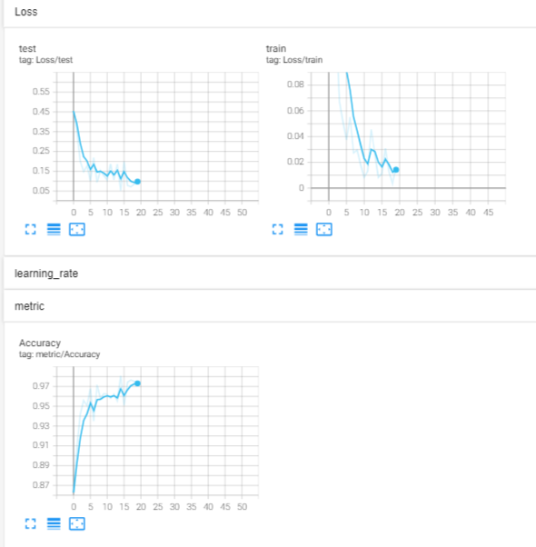
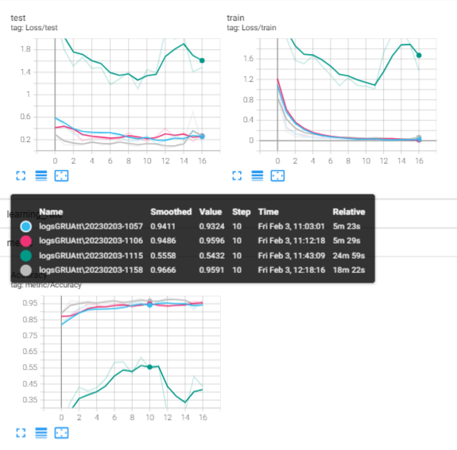
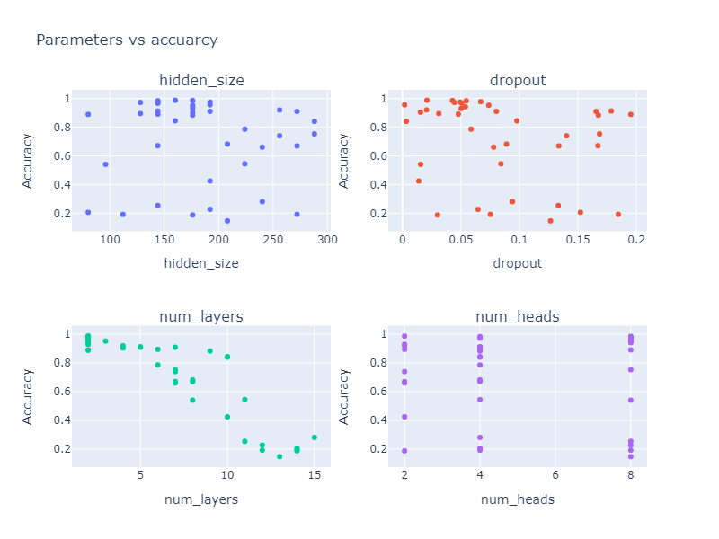

# Tentamen ML2022-2023

De opdracht is om de audio van 10 cijfers, uitgesproken door zowel mannen als vrouwen, te classificeren. De dataset bevat timeseries met een wisselende lengte.

In [references/documentation.html](references/documentation.html) lees je o.a. dat elke timestep 13 features heeft.
Jouw junior collega heeft een neuraal netwerk gebouwd, maar het lukt hem niet om de accuracy boven de 67% te krijgen. Aangezien jij de cursus Machine Learning bijna succesvol hebt afgerond hoopt hij dat jij een paar betere ideeen hebt.

## Vraag 1

### 1a
In `dev/scripts` vind je de file `01_model_design.py`.
Het model in deze file heeft in de eerste hidden layer 100 units, in de tweede layer 10 units, dit heeft jouw collega ergens op stack overflow gevonden en hij had gelezen dat dit een goed model zou zijn.
De dropout staat op 0.5, hij heeft in een blog gelezen dat dit de beste settings voor dropout zou zijn.

- Wat vind je van de architectuur die hij heeft uitgekozen (een Neuraal netwerk met drie Linear layers)? 

GVH: Het gebruik van een Linear layer leidt niet tot optimale benutting van de informatie van de tijdsvolgorde. Bovendien is de dimensieverminderende stap, een stap waarbij veel informatie verloren gaat.

- Wat zijn sterke en zwakke kanten van een model als dit in het algemeen? 

GVH: Een Linear layer is geschikt voor gevectoriseerde data (met twee dimensies in tensors) waarbij de (tijds)volgordelijkheid in de data geen invloed (meer) heeft op de doelwaarde. Alleen de afzonderlijke vector geeft informatie over de doelwaarde.

- En voor dit specifieke probleem?

GVH: In dit geval is er een extra dimensie aanwezig, tijd (3 dimensies in tensor), hierdoor speelt er een afhankelijkheid van de volgorde van het aanbieden van de data. Voordat een Linear layer optimaal kan functioneren, moet deze afhankelijkheid op een passende manier worden vertaald naar een of meerder variabelen. oftewel van 3 naar 2 dimensies gaan. Bovendien is de unitaantal niet afnemend van groot naar klein (in dit geval van 10 naar 20), waardoor er opnieuw informatie verloren gaat. De tweede hidden layers heeft 10 units, wat minimaal even groot zou moeten zijn als de output layer om informatieverlies te voorkomen.

- Wat vind je van de keuzes die hij heeft gemaakt in de LinearConfig voor het aantal units ten opzichte van de data? En van de dropout?

GVH: Er zijn 330 sets per categorie op basis van geslacht en cijfer, wat in totaal 6600 situaties oplevert. Dit lijkt voldoende data om een goed model te trainen. Echter, voor een hoge dropout, zoals 0.5, is meer trainingsdata nodig. De hoge dropout lijkt hier niet verantwoord te zijn. Met betrekking tot de dropout in verhouding tot de laagdikte is de eerste hidden layer in orde. Echter, de tweede hidden layer van 10 units is te klein. Dit betekent dat het model met 5 fuctionele units in staat is 20 labels te classificeren. Theoretisch kan dit wel, alleen is het niet optimaal.

## 1b
Als je in de forward methode van het Linear model kijkt (in `tentamen/model.py`) dan kun je zien dat het eerste dat hij doet `x.mean(dim=1)` is. 

- Wat is het effect hiervan? Welk probleem probeert hij hier op te lossen? (maw, wat gaat er fout als hij dit niet doet?)

GVH: Door middel hiervan wordt het gemiddelde genomen van een feature over de tijd (13 features), wat betekent dat de tijdreeks plat wordt gemaakt en een dimensie wordt gereduceerd, en de variabele tijdlengte wordt geëlimineerd.

- Hoe had hij dit ook kunnen oplossen?

GVH: De flatten()-methode en daarbij moeten alle sets even lang worden gamaakt als de langste tijdreeks in de dataset en de lege plaatsen op te vullen met bijvoorbeeld 0. Of door alle sets af te knippen naar de kortste dataset.

- Wat zijn voor een nadelen van de verschillende manieren om deze stap te doen?

GVH: `x.mean(dim=1)` reduceert het aantal te trainen gewichten, waardoor de trainingssnelheid verhoogt. Maar door het nemen van het gemiddelde van de lange tijdreeks wordt veel informatie verloren.
`flatten()` geeft de input layer veel units en gewichten om te trainen, waardoor veel data nodig is en de trainingsduur verlengt wordt. Het risico op overfitting wordt ook groter. Echter, wordt er hier geen informatie verloren

### 1c
Omdat jij de cursus Machine Learning hebt gevolgd kun jij hem uitstekend uitleggen wat een betere architectuur zou zijn.

- Beschrijf de architecturen die je kunt overwegen voor een probleem als dit. Het is voldoende als je beschrijft welke layers in welke combinaties je zou kunnen gebruiken.

GVH: Modellen met geheugen, zoals 1D-convolution, RNN, LSTM, GRU en Attention, kunnen tijd als extra dimensie verwerken. Deze lagen kunnen apart of samen gebruikt worden en moeten eindigen met een dense layer om de dimensie te reduceren (van 3 naar 2) voor classificatie. Bij 1D-convolution en Attention moet de tijdsreekslengte constant zijn of worden gamaakt.

Combineren van RNN, LSTM en GRU heeft minder voordelen omdat ze op een vergelijkbaar principe werken en de ene de evolutie is van de andere. RNN is het minst geschikt van de drie voor deze taak, omdat de tijdsreeksen ongeveer 60 tot 90 stappen groot zijn en het geheugen van een RNN beperkt is, waardoor de prestaties waarschijnlijk minder goed zullen zijn.

- Geef vervolgens een indicatie en motivatie voor het aantal units/filters/kernelsize etc voor elke laag die je gebruikt, en hoe je omgaat met overgangen (bv van 3 naar 2 dimensies). Een indicatie is bijvoorbeeld een educated guess voor een aantal units, plus een boven en ondergrens voor het aantal units. Met een motivatie laat je zien dat jouw keuze niet een random selectie is, maar dat je 1) andere problemen hebt gezien en dit probleem daartegen kunt afzetten en 2) een besef hebt van de consquenties van het kiezen van een range.

GVH: In dit voorbeeld wordt het gestures-probleem gebruikt. Het probleem lijkt op elkaar, maar heeft een langere tijdsreeks, meer features en het moet twee keer zoveel labels classificeren. Het probleem en de data is dus relatief complexer en verwacht wordt dat de parameters hoger liggen. De instellingen waarbij een goed resultaat wordt verwacht zijn:

hidden_size=100, num_layers=3, num_heads=4, dropout=0.05

Deze parameters kunnen variëren binnen de volgende bereiken:

hidden_size=50-250, num_layers=1-15, num_heads=1-10, dropout=0-0.2

- Geef aan wat jij verwacht dat de meest veelbelovende architectuur is, en waarom (opnieuw, laat zien dat je niet random getallen noemt, of keuzes maakt, maar dat jij je keuze baseert op ervaring die je hebt opgedaan met andere problemen).

GVH: Een goede opzet zou zijn om GRU, Attention en een dense layer te gebruiken, met het gestures-probleem als voorbeeld.

De input is 13: Per tijdseenheid zijn 13 features beschikbaar.
De output is 20: 10 digit per geslacht leidt tot 10 * 2 = 20 classificaties.
De hidden_size is 100,
de num_layers zijn 3,
de num_heads zijn 4 
en de dropout is 0.05.

### 1d
Implementeer jouw veelbelovende model: 

- Maak in `model.py` een nieuw nn.Module met jouw architectuur
- Maak in `settings.py` een nieuwe config voor jouw model
- Train het model met enkele educated guesses van parameters. 
- Rapporteer je bevindingen. Ga hier niet te uitgebreid hypertunen (dat is vraag 2), maar rapporteer (met een afbeelding in `antwoorden/img` die je linkt naar jouw .md antwoord) voor bijvoorbeeld drie verschillende parametersets hoe de train/test loss curve verloopt.
- reflecteer op deze eerste verkenning van je model. Wat valt op, wat vind je interessant, wat had je niet verwacht, welk inzicht neem je mee naar de hypertuning.

GVH: Om te beginnen is het model getraind met de voorgestelde parameters: hidden_size=100, num_layers=3, num_heads=4 en dropout=0.05. Zie het resultaat hieronder. Zie het resultaat hieronder in Fig 1.

<figure>
  

    
    <figcaption align="center">
      <b> Fig 1. GRUAtt met hidden_size=100 num_layers=3 num_heads=4 dropout=0.05</b>
    </figcaption>
  

</figure>

In Fig 1 valt op dat het model het goed doet, met een accuracy van 0.975 na ongeveer 17 epochs. Dit betekent dat de instellingen al goed zijn. Tevens is te zien dat het model te weinig epochs heeft getraind, aangezien de loss nog aan het dalen is en de accuracy nog aan het stijgen. Het optimale aantal epochs is bereikt wanneer zowel de train-, testloss-  en de accuracy-lijnen een horizontaal zijn. Echter, moet eerder worden gestopt met rainen als de test-loss begint te stijgen en de train-loss nog aan het dalen is. Dit is het teken van overfitten. 

Hieronder is gekeken wat de invloed is om de parameters te verhogen. Het gaat om de dropout aantal hidden layers, omdat embed_dim (hidden_size) altijd deelbaar moet zijn door de Num_head. Hierdoor is alleen een kleine range mogelijk. In vraag 2 wordt hierop terugekomen.

Hieronder is onderzocht welke invloed het verhogen van de parameters heeft. Het betreft het dropout-aantal en het aantal hidden size en num_layers, omdat de dimensie van de hidden_size altijd deelbaar moet zijn door het aantal Num_heads is deze vast gezet. In vraag 2 wordt hierop terugekomen.

De volgende runs zijn in Fig 2 te zien:

Blauw: hidden_size=100, num_layers=3, num_heads=4, dropout=0.05
Rood: hidden_size=100, num_layers=3, num_heads=4, dropout=0.3
Groen: hidden_size=100, num_layers=15, num_heads=4, dropout=0.05
Grijs: hidden_size=300, num_layers=3, num_heads=4, dropout=0.05

<figure>
  

    
    <figcaption align="center">
      <b> Fig 2. GRUAtt</b>
    </figcaption>
  

</figure>

In fig 2 valt op dat de lijnen van Blauw en Rood redelijk gelijk zijn. Echter, lijkt een relatief hoog aantal num_layers slecht te presteren en over te fitten, omdat de test-loss (ongeziende data) stijgt terwijl de train-loss daalt. De grijze lijn met meer hidden sizes lijkt het relatief beter te doen, namelijk een lagere loss op de testset en een hoger gemiddelde accuracy over het aantal epochs. Hieruit kan worden geconcludeerd dat het optimale aantal verstopt formaat waarschijnlijk groter is dan 100 en het aantal lagen kleiner dan 15. De dropout-grootte tot 30% lijkt niet veel impact te hebben.

## Vraag 2
Een andere collega heeft alvast een hypertuning opgezet in `dev/scripts/02_tune.py`.

### 2a
Implementeer de hypertuning voor jouw architectuur:
- zorg dat je model geschikt is voor hypertuning
- je mag je model nog wat aanpassen, als vraag 1d daar aanleiding toe geeft. Als je in 1d een ander model gebruikt dan hier, geef je model dan een andere naam zodat ik ze naast elkaar kan zien.
- Stel dat je data loader etc
- voeg jouw model in op de juiste plek in de `tune.py` file.
- maak een zoekruimte aan met behulp van pydantic (naar het voorbeeld van LinearSearchSpace), maar pas het aan voor jouw model.
- Licht je keuzes toe: wat hypertune je, en wat niet? Waarom? En in welke ranges zoek je, en waarom? Zie ook de [docs van ray over search space](https://docs.ray.io/en/latest/tune/api_docs/search_space.html#tune-sample-docs) en voor [rondom search algoritmes](https://docs.ray.io/en/latest/tune/api_docs/suggestion.html#bohb-tune-search-bohb-tunebohb) voor meer opties en voorbeelden.

GVH: Over het algemeen zijn naar de parameter gezocht waardoor het model relaief complexer wordt. Ook is gezocht naar instellinegen waardoor het model minder complex wordt. Hieronder de instellingen met toelichting:

De parameter Num_head is hier niet onafhankelijk onderzocht, omdat embed_dim (hidden_size) altijd door Num_head deelbaar moet zijn. Het is mogelijk om een afhankelijkheid te creëren tussen num_heads en hidden-sizes, maar dit is niet mogelijk in combinatie met TuneBOHB. Daarom is gekozen voor een bereik van [2, 4, 8]. Met de qrandint functie zal de hidden_size alleen stappen van 16 nemen, wat deelbaar is door 2, 4 en 8.

De volgende bereiken zijn geselecteerd:

hidden_size: tune.qrandint(64, 288, 16)
De hidden size 100 presteert goed. Er wordt onderzocht of het model nog complexer kan worden en misschien minder complex. In de vorige vraag bleek dat een grotere hidden_size kan leiden tot verbetering van de prestaties. qrandint wordt gebruikt omdat hidden_size ook staat voor embed_dim en deze parameter moet deelbaar zijn door het aantal heads.

num_layers: tune.randint(1, 15)
Veel lagen maken het model complex. Hierdoor heeft het model meer epochs nodig om een hogere nauwkeurigheid te bereiken. Hierdoor zullen deze runs ook sneller beëindigd worden omdat ze niet snel goed presteren. Bovendien kan het model overfitting krijgen door de vele parameters. Dit is in de vorige vraag getoond.

num_heads: tune.choice([2, 4, 8])
Het aantal 4 geeft al goede resultaten. Door de afhankelijkheid met hidden_size is deze lastiger te optimaliseren met de huidige instelling. Daarom is gekozen voor dit bereik, aangezien het deelbaar is door 16.

dropout: tune.uniform(0.0, 0.2)
Een dropout van 0.05 werkt goed. Bovendien is er niet te veel data beschikbaar. Daarom is een maximum van 20% gekozen.

### 2b
- Analyseer de resultaten van jouw hypertuning; visualiseer de parameters van jouw hypertuning en sla het resultaat van die visualisatie op in `reports/img`. Suggesties: `parallel_coordinates` kan handig zijn, maar een goed gekozen histogram of scatterplot met goede kleuren is in sommige situaties duidelijker! Denk aan x en y labels, een titel en units voor de assen.

- reflecteer op de hypertuning. Wat werkt wel, wat werkt niet, wat vind je verrassend, wat zijn trade-offs die je ziet in de hypertuning, wat zijn afwegingen bij het kiezen van een uiteindelijke hyperparametersetting.

Importeer de afbeeldingen in jouw antwoorden, reflecteer op je experiment, en geef een interpretatie en toelichting op wat je ziet.

gvh:

<figure>
  

    
    <figcaption align="center">
      <b> Fig 3. GRUAtt met hidden_size=100 num_layers=10 num_heads=3 dropout=0.05</b>
    </figcaption>
  

</figure>

Met de Ray tuning is een accuracy van bijna 99% behaald. De beste prestaties worden duidelijk weergegeven door de Ray tuning, waarbij een hidden size van rond de 160 het beste resultaat oplevert. Het dropout percentage dient rond de 2% te liggen. Het optimale aantal lagen is 2. Er was een fout in de code bij het aantal heads (num_heads was hardcoded op 4 en de config dictionary was uitgecommentarieerd), die later is opgelost. Omdat de score al zo hoog was, is er geen nieuwe run uitgevoerd en het optimum lijkt op 4 te liggen.

### 2c
- Zorg dat jouw prijswinnende settings in een config komen te staan in `settings.py`, en train daarmee een model met een optimaal aantal epochs, daarvoor kun je `01_model_design.py` kopieren en hernoemen naar `2c_model_design.py`.

GVH: Het model staat klaar. met 03_result.py kan het model worden getest.

## Vraag 3
### 3a
- fork deze repository.
- Zorg voor nette code. Als je nu `make format && make lint` runt, zie je dat alles ok is. Hoewel het in sommige gevallen prima is om een ignore toe te voegen, is de bedoeling dat je zorgt dat je code zoveel als mogelijk de richtlijnen volgt van de linters.
- We werken sinds 22 november met git, en ik heb een `git crash coruse.pdf` gedeeld in les 2. Laat zien dat je in git kunt werken, door een git repo aan te maken en jouw code daarheen te pushen. Volg de vuistregel dat je 1) vaak (ruwweg elke dertig minuten aan code) commits doet 2) kleine, logische chunks van code/files samenvoegt in een commit 3) geef duidelijke beschrijvende namen voor je commit messages
- Zorg voor duidelijke illustraties; voeg labels in voor x en y as, zorg voor eenheden op de assen, een titel, en als dat niet gaat (bv omdat het uit tensorboard komt) zorg dan voor een duidelijke caption van de afbeelding waar dat wel wordt uitgelegd.
- Laat zien dat je je vragen kort en bondig kunt beantwoorden. De antwoordstrategie "ik schiet met hagel en hoop dat het goede antwoord ertussen zit" levert minder punten op dan een kort antwoord waar je de essentie weet te vangen. 
- nodig mij uit (github handle: raoulg) voor je repository. 
